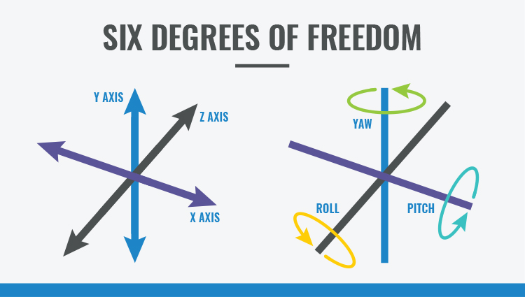

```{r setup, include=FALSE}
knitr::opts_chunk$set(echo = FALSE)
import::from("rospca", "robpca")
datadir <- file.path(here::here(), "data")
crunches <- readRDS(file.path(datadir, "crunches.Rds"))
situps <- readRDS(file.path(datadir, "situps.Rds"))

```

```{r functions, echo = FALSE}

plot_6axis <- function(dat, main = NULL, ...)
{
  layout(matrix(1:6,ncol = 1))
  for(i in 2:7)
  {
    par(mar = c(1.7, 4, 0.5,0.3))
    plot(dat$time,dat[[i]], type = "n", ylab = paste(main, names(dat)[i]), xlab = "", ...)
    points(dat$time,dat[[i]], type = "l")
    ylim <- par("usr")[3:4]
    abline(h=0,col = gray(0.4),lty = 3)
  }
}
```

## Gymtrack {.smaller}
{#id .class width=80% height=80%}

image from https://images.app.goo.gl/bpU4ZgrgTfjSR4cY8

## 6-axis motion sensor {.smaller}
{#id .class width=80% height=80%}

image from https://www.ceva-dsp.com/ourblog/what-is-an-imu-sensor/

## Crunches

```{r crunches plot}
plot_6axis(crunches)
```

## Sit-ups

```{r situps plot}
plot_6axis(situps)
```

## Realign data (situps)

```{r pca}
temp <- situps[176 + 1:100,]
dd <- as.matrix(temp[2:4])
pca_res <- robpca(dd, 3)
loadings <- pca_res$loadings
ddr <- sweep(dd, 2, pca_res$center) %*% loadings
for(i in 5:7) temp[[i]] <- ddr[,i-4]
colnames(temp) <- c(colnames(temp)[1:4], paste0("PC", 1:3))
plot_6axis(temp)

```

## Rolling PCA (situps)
```{r rolling pca situps}

realign_data <- function(dat) {
  dd <- as.matrix(dat[2:4])
  roll_rpca_fun <- function(i) {
    ddd <- dd[i + -49:50,]
    res <- robpca(ddd, 3)
    (dd[i,] - res$center) %*% res$loadings
  }
  
  ddr <- t(sapply(seq(50, nrow(dd) - 50), roll_rpca_fun))
  ddr <- rbind(matrix(NA_real_, ncol = 3, nrow = 49), ddr, matrix(NA_real_, ncol = 3, nrow = 50))
  temp <- dat
  for(i in 5:7) temp[[i]] <- ddr[,i-4]
  colnames(temp) <- c(colnames(temp)[1:4], paste0("PC", 1:3))
  temp  
}

temp <- realign_data(situps)
plot_6axis(temp)
situps_y <- temp[[4]]

```

## Rolling PCA (crunches)
```{r rolling pca crunches}
temp <- realign_data(crunches)
plot_6axis(temp)
crunches_y <- temp[[4]]
```

## Detecting repetitive motion (situps)

```{r synchrosqueezing wavelet transform situps}


## 

